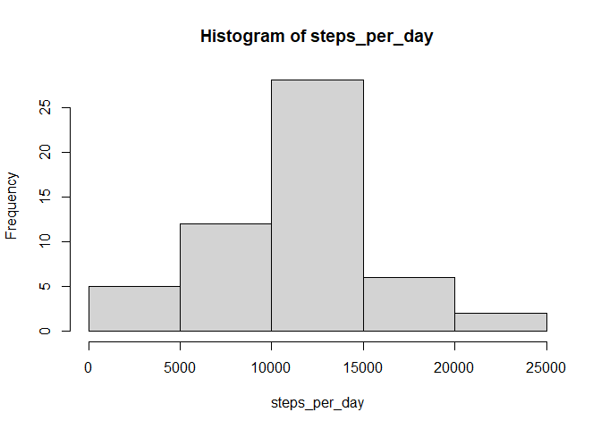
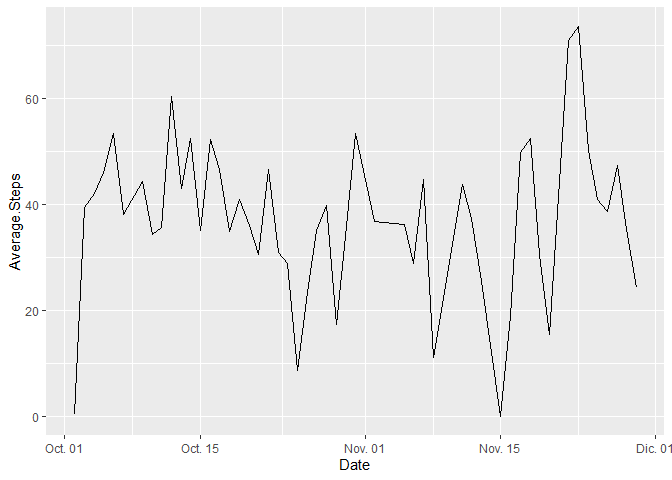
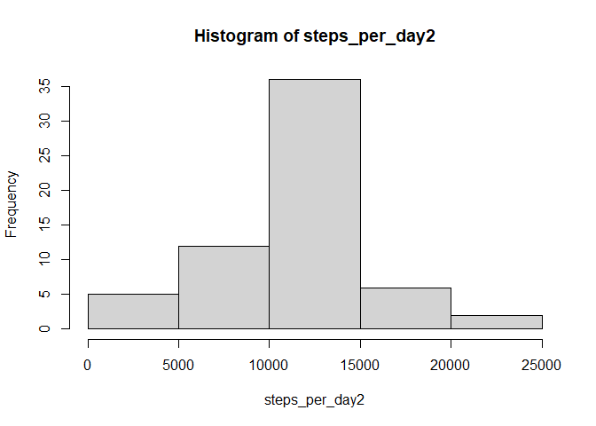

## Loading and preprocessing the data

```r
library(dplyr)
```

```
## 
## Attaching package: 'dplyr'
```

```
## The following objects are masked from 'package:stats':
## 
##     filter, lag
```

```
## The following objects are masked from 'package:base':
## 
##     intersect, setdiff, setequal, union
```

```r
library(ggplot2)
data <- read.csv(unz("activity.zip","activity.csv"))
```
## What is mean total number of steps taken per day?

```r
list_dates <- split(data,data$date)
steps_per_day <- sapply(list_dates,function(x){sum(x[,1])})
hist(steps_per_day)
```

<!-- -->

```r
c(mean = mean(steps_per_day,na.rm=T),median=median(steps_per_day,na.rm=T))
```

```
##     mean   median 
## 10766.19 10765.00
```
## What is the average daily activity pattern?

```r
average_steps1 <- sapply(list_dates,function(x){mean(x[,1],na.rm=T)})
average_steps1 <- data.frame("Date"=as.Date(names(average_steps1),"%Y-%m-%d"),
                            "Average.Steps"=average_steps1)
average_steps1%>%filter(!is.na(Average.Steps))%>%ggplot(aes(Date,Average.Steps)) + geom_line()
```

<!-- -->

```r
list_intervals <- split(data,data$interval)
average_steps2 <- sapply(list_intervals,function(x){mean(x[,1],na.rm=T)})
average_steps2 <- data.frame("interval"=as.numeric(names(average_steps2)),
                             "Average.Steps"=average_steps2)
average_steps2$Interval[which.max(average_steps2$Average.Steps)]
```

```
## NULL
```

## Imputing missing values


```r
data %>% filter(is.na(steps)) %>% nrow
```

```
## [1] 2304
```

```r
data_noNa <- merge(data,average_steps2)
data_noNa$steps[which(is.na(data_noNa$steps))] <- data_noNa$Average.Steps[which(is.na(data_noNa$steps))]
data_noNa <- data_noNa %>% select(steps,date,interval)%>% arrange(date,interval)
list_dates2 <- split(data_noNa,data_noNa$date)
steps_per_day2 <- sapply(list_dates2,function(x){sum(x[,1])})
hist(steps_per_day2)
```

<!-- -->

```r
c(mean = mean(steps_per_day2),median=median(steps_per_day2))
```

```
##     mean   median 
## 10766.19 10766.19
```
## Are there differences in activity patterns between weekdays and weekends?


```r
data_noNa$date <- as.Date(strptime(data_noNa$date,format="%Y-%m-%d"))
data_noNa$day <- weekdays(data_noNa$date)
data_noNa$day <- ifelse(data_noNa$day %in% c("sábado","domingo"),"weekend","weekday")
StepsPerTimeDT <- aggregate(steps~interval+day,data=data_noNa,FUN=mean,na.action=na.omit)
p <- ggplot(StepsPerTimeDT,aes(interval,steps)) + geom_line() + facet_grid(day~ .)
p
```

<!-- -->
